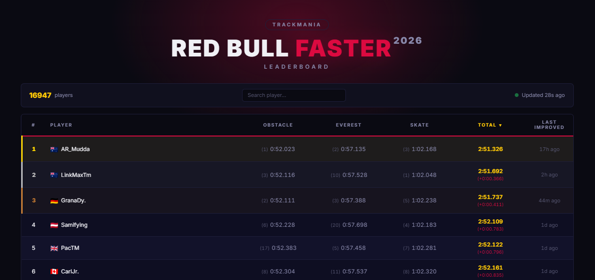

# Red Bull FASTER 2026 — Leaderboard

Leaderboard for the Red Bull FASTER 2026 tournament.

Displays current time of players on all 3 of the maps (Obstacle, Everest, Skate) + when they last improved one of their times.  
You can search for players and also sort the leaderboard to one map by clicking on the mapname.  
Times are updated every minute.



## How it works

A **Cloudflare Worker** cron job runs every 60 seconds, fetching leaderboard data from Nadeo's Live Services API for all three maps. It aggregates player times, resolves display names and country flags, then stores the result in Cloudflare KV.

The **frontend** (hosted on GitHub Pages) polls the worker API every 60 seconds and renders the leaderboard client-side with sorting, search, and pagination.

## Tech Stack

- **Backend**: Cloudflare Worker with Cron Triggers + KV storage
- **Frontend**: Vanilla HTML/CSS/JS on GitHub Pages
- **Data source**: Nadeo Live Services API (Leaderboard times) + Trackmania OAuth API (Player UUID to player displayname translation)

## Features

- Live combined ranking across all three maps
- Per-map times and ranks with sortable columns
- Delta to 1st place
- Country flags
- Player search
- Auto-refresh every 60 seconds

## Project Structure

```
worker/          Cloudflare Worker (cron + API)
  src/index.js   Main worker code
  wrangler.toml  Cloudflare config
docs/            Frontend (GitHub Pages)
  index.html     Page structure
  script.js      Client-side logic
  style.css      Styling
```

## License

Not affiliated with Red Bull or Ubisoft Nadeo. Data sourced from Nadeo Live Services.
